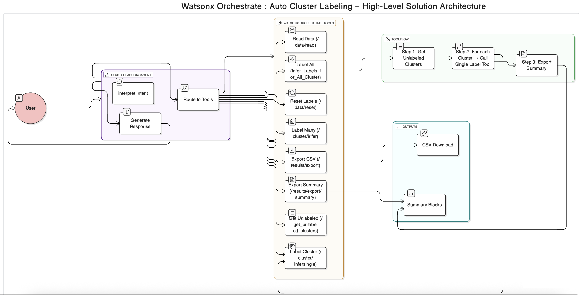

# Migrato Agentic Cluster Labeling Orchestrator

An AI-powered **document classification and cluster labeling assistant** built on **IBM watsonx** and foundation models (Meta Llama 3.2 90B Vision Instruct).  

This project orchestrates end-to-end cluster labeling workflows:

- Reads clustered document data
- Samples representative documents
- Infers intelligent cluster-level labels using LLMs
- Tracks similarity & status (Auto / Auto-Similar / ManualReview)
- Supports manual review and incremental labeling
- Exports clean summaries and CSV results for downstream use

---


## Architecture



## Agent Overview
**Agent name:** `AI_Cluster_Labeling_Agent`  
**Kind:** `native` (watsonx Orchestrate agent)  
**Model:** `watsonx/meta-llama/llama-3-2-90b-vision-instruct`  

The agent is designed to drive the following high-level flows:

### 1. Start Labeling

User says things like:

- “Start labeling”
- “Label my clusters”
- “Begin labeling”

Agent calls:

- `GET /data/read`

Then behaves according to the state of the dataset:

- **Case 1 – All clusters labeled**

  > All `<total_clusters>` clusters have already been labeled.  
  > There are no unlabeled clusters remaining.  
  >  
  > _Would you like to reset all labels and start over?_

- **Case 2 – All clusters unlabeled**

  - Shows total clusters
  - Lists all unlabeled cluster IDs
  - Asks whether to:
    - Label all clusters, or
    - Start with a specific cluster

- **Case 3 – Partial progress**

  - Shows labeled vs unlabeled counts
  - Lists unlabeled cluster IDs
  - Asks whether to:
    - Label all remaining clusters, or
    - Start with a specific cluster

---

### 2. Labeling Actions

The agent supports several labeling modes:

#### 2.1 Reset All Labels

User: “Reset all”

- Call: `POST /data/reset?confirm=true`

Response to user:

> All labels have been reset.  
> Would you like to start labeling from the beginning?

---

#### 2.2 Label All Clusters

User: “Label all clusters”

- Calls the **Infer Labels for All Cluster** tool:
  - Tool name in agent: `Infer_Labels_for_All_Cluster_4468MT`
  - Typically routes to an API that processes all unlabeled clusters

---

#### 2.3 Label a Single Cluster

User:

- “Label cluster 5”
- “Run cluster 3”
- “Label cluster with id 5”

Agent calls:

- `POST /cluster/infersingle?cluster_id=<id>`

---

#### 2.4 Label Next N Clusters

User:

- “Label next 3 clusters”
- “Label 2 more clusters”

Agent calls:

- `POST /cluster/inferlimit?limit=N`

Rules:

- Only `limit` is sent
- **Do not** send `cluster_id` or `process_all`

---

### 3. Inference Tracking

For each inference operation, the agent (and backend) track:

- `cluster_id`
- `cluster_label`
- `status` → `Auto` / `Auto-Similar` / `ManualReview`
- `similarity_score`
- `labels_used` (mapping of filename → label)

These are used for internal decision-making and reporting.

---

### 4. Summary & Export Flows

#### 4.1 Summary (“Show me a summary”)

User: “Show me a summary”, “Show progress”, “Show all labels so far”

Agent calls:

- `GET /results/export/summary`

Agent then generates a **multi-block summary**:

1. **Overview**

   ```text
   You have <total_clusters> clusters in total.
   <labeled_clusters> clusters are labeled and <unlabeled_clusters> are unlabeled.
   Labeling coverage: <coverage_percent>%.
   Dominant label so far: "<dominant_label>" (<dominant_label_ratio>% of labeled clusters).

2. **Labeled Cluster Breakdown (Table)**

   Only if there are labeled clusters:

   | Label | Cluster Count | Cluster IDs |
   | ----- | ------------- | ----------- |

3. **Status Breakdown**

   | Status | Documents |
   | ------ | --------- |

4. **Download (Optional)**
   If `file_source` is present:

   ```text
   You can download the latest labeling file here: [Click here to download](file_source)
   ```

---

#### 4.2 Multi-Cluster Inference Summary

After processing multiple clusters (limit or process_all):

```text
<N> clusters have been processed. Here is the summary:
```

Followed by:

| Cluster ID | Label | Similarity | Notes |
| ---------- | ----- | ---------- | ----- |

End with:

```text
Would you like to label more clusters?
```

---

#### 4.3 Single-Cluster Summary

* **Newly labeled**

  ```text
  Cluster <id> has been labeled as "<label>".
  Would you like to label another cluster?
  ```

* **Already labeled**

  ```text
  Cluster <id> has already been labeled as "<label>".
  Would you like to label another cluster?
  ```

* **Manual review required**

  ```text
  Cluster <id> requires manual review.
  Would you like to provide a manual label now?
  ```

---

### 5. Manual Review Flow

If the backend marks any clusters with `ManualReview`:

```text
The following clusters require manual review: [cluster_ids]

Would you like to provide manual labels now?
```

The agent then:

* Accepts user-provided labels
* Allows re-running inference for those cluster IDs

---

### 6. Tooling Overview (Agent → Backend)

The agent is configured with the following tools (as declared in the YAML):

* `read_data` → `/data/read`
* `reset_labels` → `/data/reset`
* `infer_labels_cluster_single` → `/cluster/infersingle`
* `infer_labels_cluster_limit` → `/cluster/inferlimit`
* `Infer_Labels_for_All_Cluster_4468MT` → process all clusters
* `results_summary` → `/results/export/summary`
* `export_results_csv` → `/results/export?format=csv`
* `i__get_flow_status_intrinsic_tool__` → internal flow status checks

> The exact HTTP methods and payloads are defined in the OpenAPI spec
> (e.g., `mig_cluster_label_openapi_v5.json`) and in the `tools/` Python modules.

---

## 🗂️ Repository Structure

Typical structure of this repo:

```text
.
├── Dockerfile
├── .gitignore
├── .dockerignore
├── env_sample               # Template for local .env (NOT committed)
├── main.py                  # Entrypoint / orchestrator
├── requirements.txt
├── agents_instruction_v2.yaml
├── mig_cluster_label_openapi_v5.json
├── AIClusterLabelingAgent_09dec_final.zip   # Importable agent package for watsonx
├── tools/
│   ├── cluster_labeler.py
│   ├── data_utils.py
│   └── watsonx_utils.py
├── database/
│   ├── dbdump_restore.md
│   └── read_dump.py
└── data/
    └── (local CSVs only, ignored by Git)
```

> **Note:**
>
> * `.env` and all files under `data/` are intentionally **not** tracked (sensitive / local artifacts).
> * Use `env_sample` as a reference when creating your own `.env`.

---

## ⚙️ Prerequisites

* Python **3.10+** (ideally 3.11)
* `pip` / `pipenv` / `venv`
* Docker (optional, for containerized runs)
* IBM watsonx access + credentials (for calling foundation models / agents)
* Backend API service exposing the cluster labeling endpoints defined in the OpenAPI spec

---

## 🔐 Environment Configuration

Create a `.env` file in the project root based on `env_sample`. Typical values might include:

* Watsonx / IAM credentials
* API base URLs (for `/data/*`, `/cluster/*`, `/results/*`)
* Model deployment IDs or project IDs

> ⚠️ **Important:**
> `.env` is **not** tracked in Git.
> Never commit your real credentials.

---

## ▶️ Running Locally

1. **Clone the repository**

   ```bash
   git clone https://github.com/<your-username>/<repo-name>.git
   cd <repo-name>
   ```

2. **Create and activate a virtual environment (recommended)**

   ```bash
   python -m venv .venv
   source .venv/bin/activate      # macOS / Linux
   # .venv\Scripts\activate       # Windows (PowerShell)
   ```

3. **Install dependencies**

   ```bash
   pip install -r requirements.txt
   ```

4. **Configure environment**

   ```bash
   cp env_sample .env
   # Edit .env with your watsonx + backend settings
   ```

5. **Run the orchestrator**

   ```bash
   python main.py
   ```

   The exact behavior depends on how `main.py` is implemented (CLI / API server / worker).
   Typically this script will:

   * Initialize connections
   * Expose APIs or workflows used by the watsonx agent tools

---

## 🐳 Running with Docker

1. **Build the image**

   ```bash
   docker build -t migrato-agentic-cluster .
   ```

2. **Run the container**

   ```bash
   docker run --rm \
     --env-file .env \
     -p 8000:8000 \
     migrato-agentic-cluster
   ```

   Adjust the exposed port based on how `main.py` / your service is configured.

---

## 🤝 Integrating with Watsonx Orchestrate

1. **Import the agent package**
   In watsonx Orchestrate, import:

   * `AIClusterLabelingAgent_09dec_final.zip`

2. **Configure tools**
   Map each tool in the agent:

   * `read_data`
   * `reset_labels`
   * `infer_labels_cluster_single`
   * `infer_labels_cluster_limit`
   * `Infer_Labels_for_All_Cluster_4468MT`
   * `results_summary`
   * `export_results_csv`

   to the corresponding backend endpoints (`/data/read`, `/cluster/infersingle`, etc.).

3. **Connect to your running backend**
   Ensure your backend (from this repo) is reachable from watsonx Orchestrate (network, auth, CORS, etc).

---

## 🧪 Example Conversations

* **Start**

  > User: `Start labeling`
  > Agent → `/data/read` → responds with cluster coverage + options.

* **Label next 3 clusters**

  > User: `Label next 3 clusters`
  > Agent → `/cluster/inferlimit?limit=3` → returns table summary.

* **Show summary**

  > User: `Show me a summary of all the labels so far`
  > Agent → `/results/export/summary` → overview + tables + optional download link.

* **Download results**

  > User: `Download results`
  > Agent → `/results/export?format=csv` → clickable CSV link.

---

## 🧭 Design Goals

* Avoid reprocessing already-labeled clusters
* Support incremental and resumable labeling
* Provide clear, structured summaries
* Enable manual review when similarity is low
* Expose clean download links (no backend filesystem paths)
* Keep instructions concise but deterministic for the agent

---
